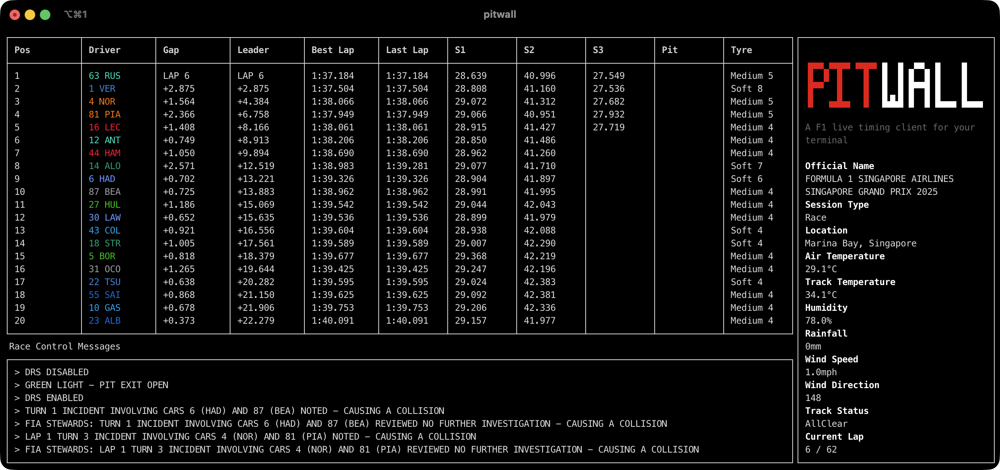
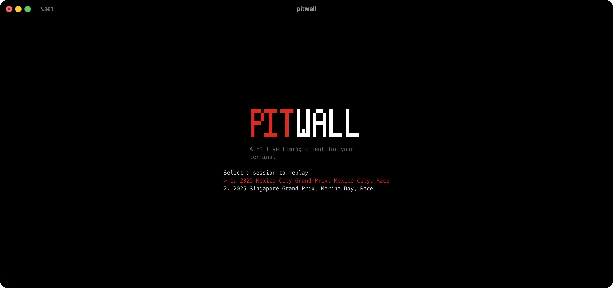

# Pitwall 🏎️

Pitwall is a open source F1 live timing TUI built in Go.



## Features
- **Timing Tower** - Real-time race positions, sector times, gap analysis, and tyre strategy tracking
- **Race Control** - Live feed of official race control messages and track status updates
- **Session Intelligence** - Comprehensive session data including weather conditions and track information

## Coming Soon
- **Qualifying Mode** - Live sector and mini sector times with real-time tracking of qualifying sessions
- **Sector Time Visualization** - Color-coded sector times displaying purple for fastest overall and green for personal best
- **Driver Tracker & Telemetry** - Live circuit map with driver positions and comprehensive car telemetry data

## Getting Started

Pitwall works with live and replayed data. To import an existing session, you run the following command to list available sessions:

```bash
pitwall import --year 2025
```

Example Output:
```bash
Key   Name                       Location           P1     P2     P3     SQ     Sprint  Qual   Race
1253  Pre-Season Testing         Sakhir             9683   9684   9685   -      -       -      -
1254  Australian Grand Prix      Melbourne          9686   9687   9688   -      -       9689   9693
1255  Chinese Grand Prix         Shanghai           9988   -      -      9989   9993    9994   9998
1256  Japanese Grand Prix        Suzuka             9999   10000  10001  -      -       10002  10006
1257  Bahrain Grand Prix         Sakhir             10007  10008  10009  -      -       10010  10014
1258  Saudi Arabian Grand Prix   Jeddah             10015  10016  10017  -      -       10018  10022
1259  Miami Grand Prix           Miami              10023  -      -      10024  10028   10029  10033
1260  Emilia Romagna Grand Prix  Imola              9980   9981   9982   -      -       9983   9987
1261  Monaco Grand Prix          Monaco             9972   9973   9974   -      -       9975   9979
1262  Spanish Grand Prix         Barcelona          9964   9965   9966   -      -       9967   9971
1263  Canadian Grand Prix        Montréal           9956   9957   9958   -      -       9959   9963
1264  Austrian Grand Prix        Spielberg          9948   9949   9950   -      -       9951   9955
1277  British Grand Prix         Silverstone        9940   9941   9942   -      -       9943   9947
1265  Belgian Grand Prix         Spa-Francorchamps  9929   -      -      9930   9934    9935   9939
1266  Hungarian Grand Prix       Budapest           9921   9922   9923   -      -       9924   9928
1267  Dutch Grand Prix           Zandvoort          9913   9914   9915   -      -       9916   9920
1268  Italian Grand Prix         Monza              9905   9906   9907   -      -       9908   9912
1269  Azerbaijan Grand Prix      Baku               9897   9898   9899   -      -       9900   9904
1270  Singapore Grand Prix       Marina Bay         9889   9890   9891   -      -       9892   9896
```

You can then import an existing session, for example, the `Singapore Grand Prix Race`

```bash
pitwall import --year 2025 --meeting 1270 --session 9896
```

## Replay a session

After importing a session, you can replay a session with
```bash
pitwall replay
```

You will be prompted to select a session:


